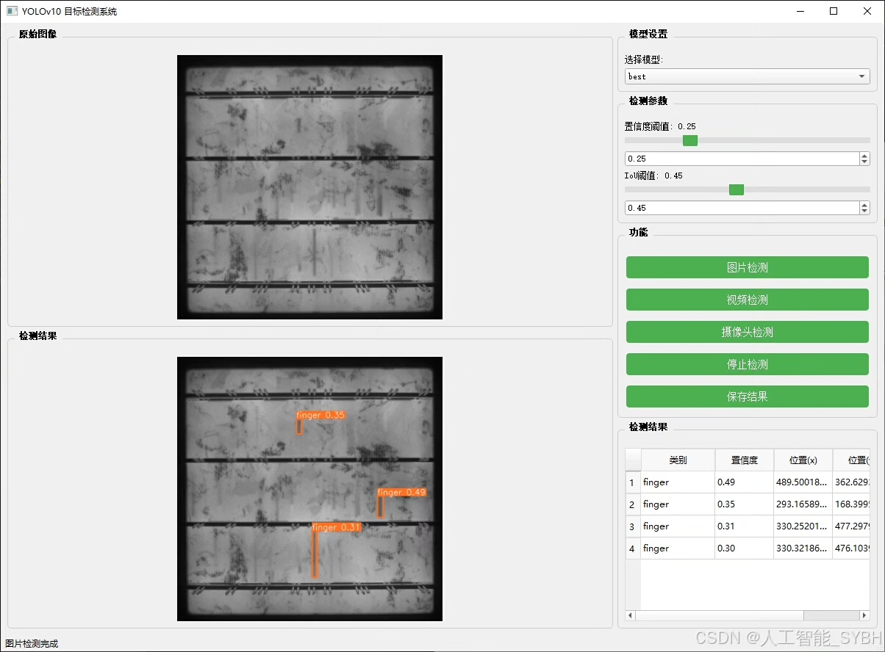
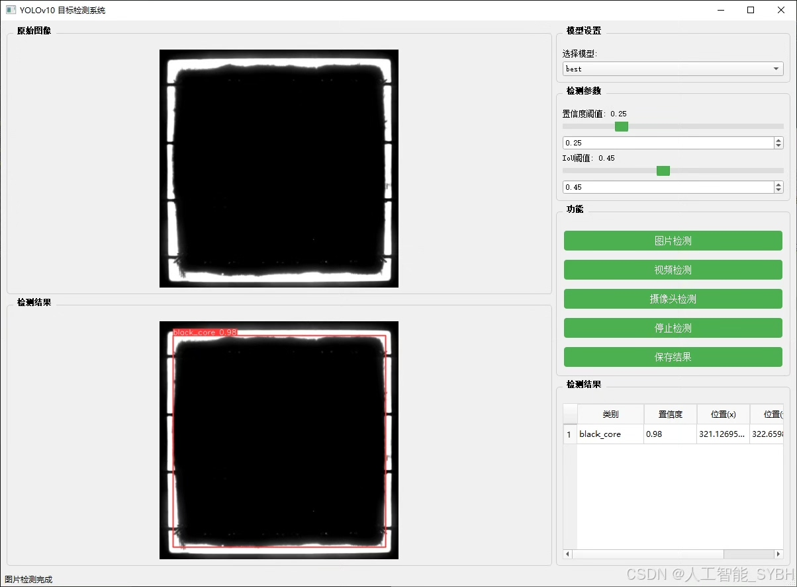
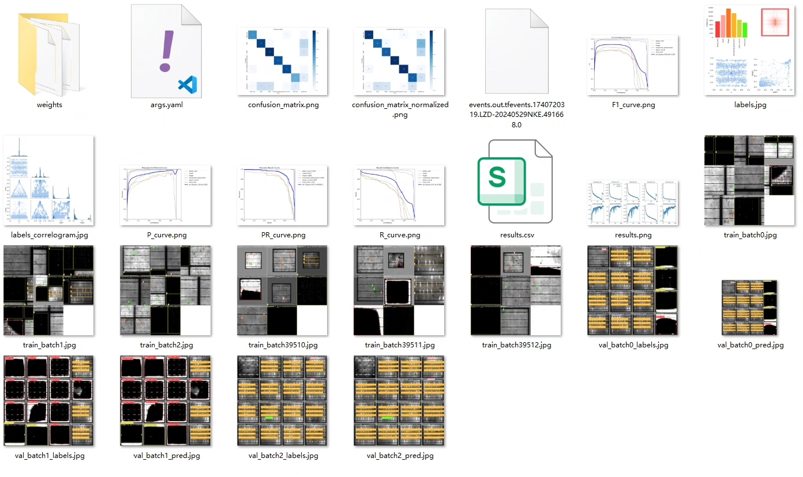
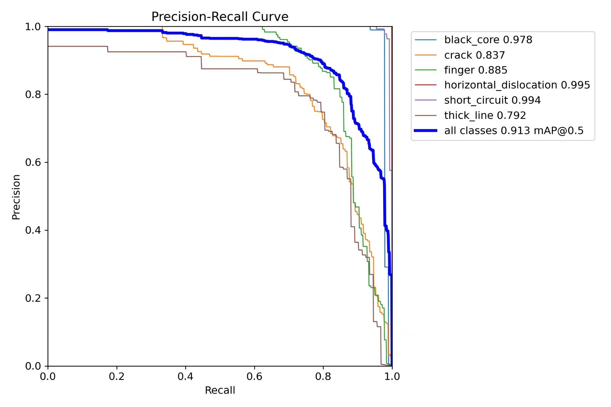
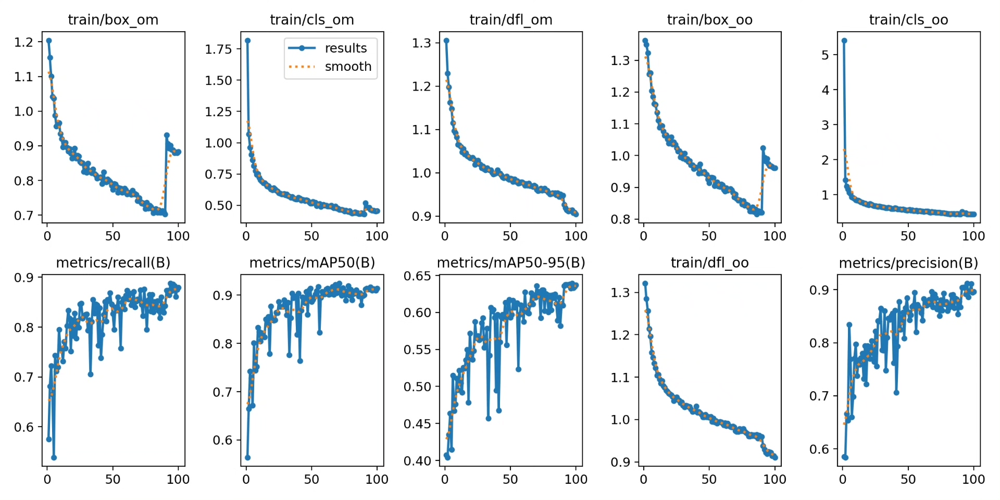
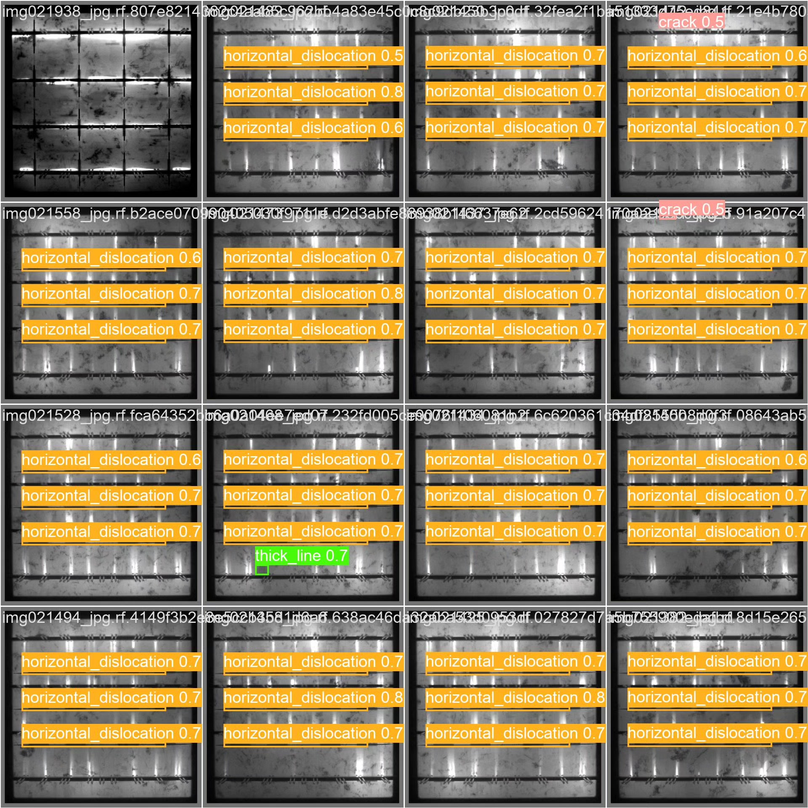
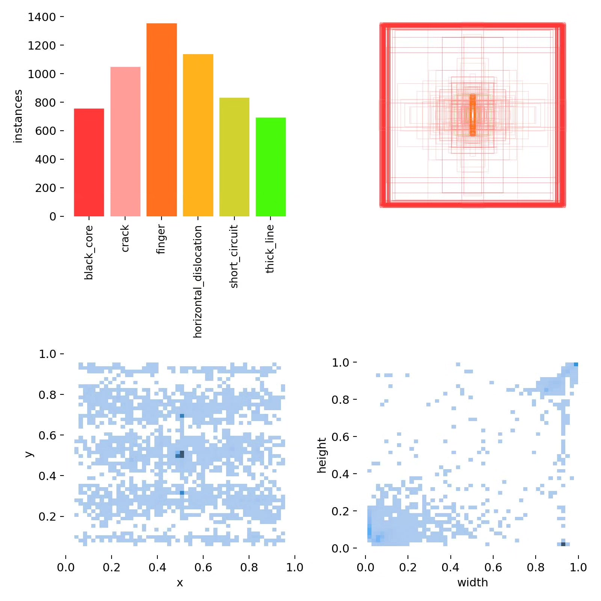
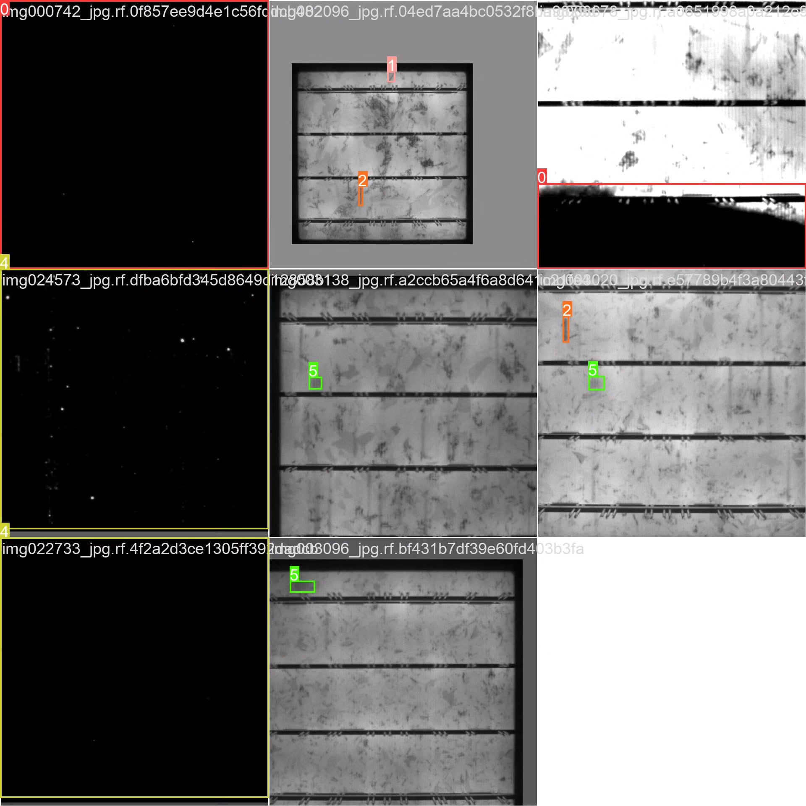

# Based on deep learning YOLOv10 for solar panel defect detection system (YOL

## Body

Based on deep learning YOLOv10, a solar panel defect detection system (YOLOv10+YOLO dataset + UI interface + Python project source code + model)

Solar panels are the core components of solar power generation systems, and their quality directly affects the efficiency and lifespan of the system. However, during production and usage, solar panels may suffer from various defects, such as black core (black core), crack (crack), finger (finger), horizontal dislocation (horizontal dislocation), short circuit (short circuit), thick line (thick line), etc. These defects can reduce the performance of the panels and even cause system failures. Traditional defect detection methods rely on manual inspection, which is inefficient and prone to missed defects. Based on deep learning target detection technology, automatic identification of solar panel defects can help production and usage units identify and address issues in a timely manner, improving the reliability and efficiency of solar power generation systems.

Our company's products have obtained YOLO official commercial license certification.

We provide after-sales service.

After payment, we will provide WeChat ID for any questions you may have.

Environmental configuration: We will provide an instructional tutorial for setting up the environment, with WeChat providing answers to questions.

Remote installation services: If you need remote configuration, an additional fee of 69 is required,
failure in configuration, all fees are refunded (specially for old computers only refund installation fees)

Retraining dataset: After setting up the environment, you can train on your own computer.
If you need us to retrain, just pay 69 plus computing power fees (2.5 yuan/hour)

Full package of after-sales service

## Images

## Payment

Here is a pay link on Stripe ( https://buy.stripe.com/3cs8yP7sY87d0vu9AB ). Please contact me lonlonago@foxmail.com after funding $89, and I will send you a complete data files , thank you!

